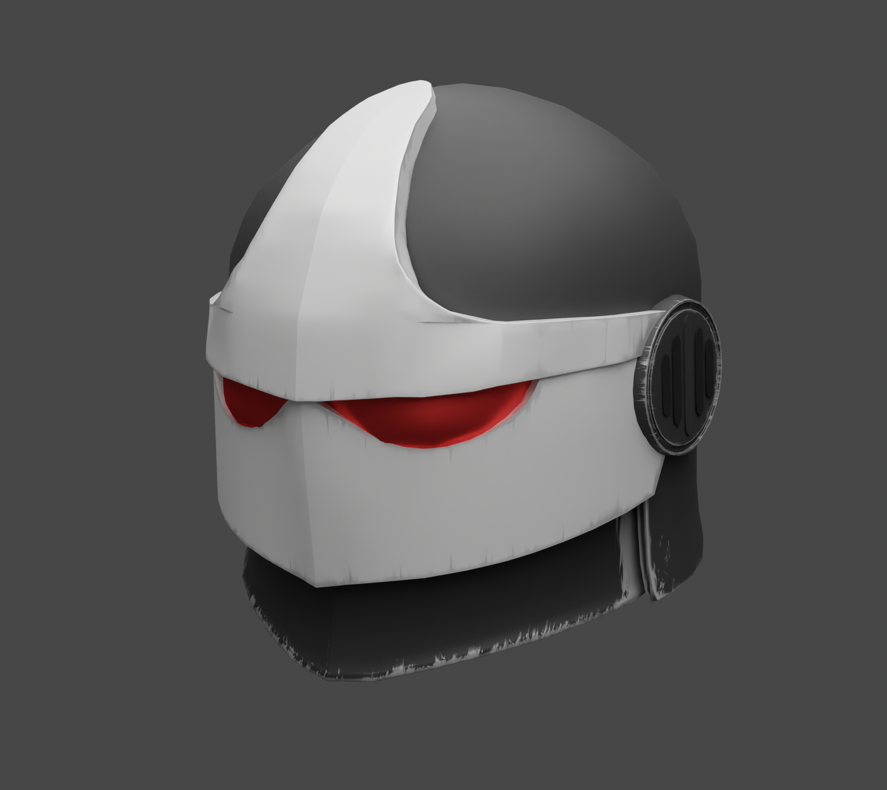
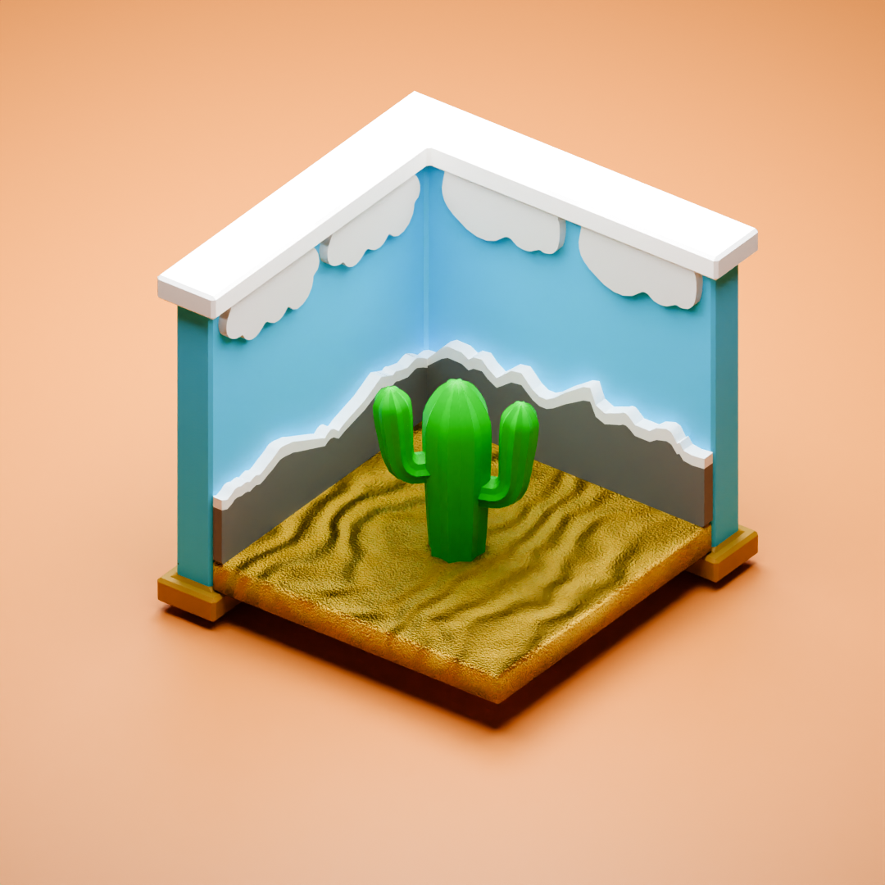

  <h1 align="center">Hello there👋</h1>

 
## Welcome in, to my humble aboad, make your self confortable
### Here we have a bit about myself
#### "Who is this strange fella?"
I am just Kleber, a tech student from UNIVESP and SENAI from Brazil. Doing my best to improve my self in anything i put my mind into. Feel free to hit me with a message on email or linkedn
##### My hobbies
I don't like laying idle, and i don't like just endless doomscrolling, so i try filling out my time with more meaninfull things

  
Blender 🥯

    I picked up blender out of sheer curiosity and i have found it to be a quite fun activity, to keep it short here are some of the models i cooked up
    

      
    

    

      
    

    

      
    

    

      
    

  
  

  
Coding 💻

  I started coding due do a series of coincidences that started with the pandemic, ever since then i been trying to become a more tech savy guy and learn everything i want and can from coding and machines
  
      

  
Games 👾

  My guilty pleasure, sadly i spend way more time at this than i'd like, but i been dialing it down. I enjoy mostly singleplayer things, aside from a few games like <i>Your Only Move is Hustle</i>, and of course <i>Minecraft</i>

  
Reading 🔖

  The one limiting factor for me in reading was the limited number of books i had access to, key word <b>was</b> ever since i got a kindle i been getting way to many books to keep track of, but as of recently i been reading: 
<ul>
  <li><b>The self taught programmer</b> by Cory Althoff</li> 
  <li><b>Manga in theory and practice</b> by Hirohiko Araki</li>
  <li><b>The Myth of Sisyphus and other essays</b> by Albert Camus</li>
  <li><b>Clean Code</b> by Robert Cecil Martin</li>
</ul>

  

#### What am i studying right now?
- I am currently studying front end prototyping in the SENAI in the system development course.
- As mentioned previously i am currently reading Cory Althoff's book, **The self taught programmer**, bashing my head at the wall due to the OOP chapters :)
- I am also currently trying to learn german, ich kann dich eina ding sagen, ich bin nicht gut darin.
#### What am i doing right now?

 

